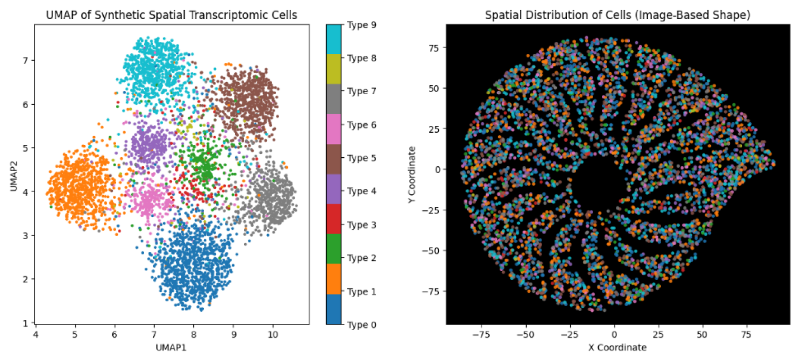

# SPATIOME: A Synthetic Data Platform for Advancing Computational Analysis in Spatial Transcriptomics

The emergence of spatial transcriptomics as a data modality has opened an unprecedented window into the intricate ballet of cellular communication and collective behavior across diverse biological and tissue contexts. While this technology captures the complexity of simultaneous cell-to-cell interactions and coordinated microscale transcriptional programs leading to emergent macroscale tissue phenomena, its direct visual manifestations can be overwhelmingly opaque without an appropriate analytical translator.

In this repository, we introduce **SPATIOME**—a platform designed to generate synthetic spatial transcriptomic data. SPATIOME serves as a computational framework that transforms opaque spatial transcriptomics data into quantifiable, biologically interpretable measures and visualizations. By leveraging tools from probabilistic inference, machine learning, topology, network theory, and emergent phenomena, this platform provides a testbed for the development and evaluation of analysis algorithms against precisely defined ground truths.

---

## Table of Contents

- [Background](#background)
- [Computational Preliminaries](#computational-preliminaries)
- [Synthetic Data Generation Framework](#synthetic-data-generation-framework)
  - [Model Components](#model-components)
  - [Parameterization of Synthetic Data](#parameterization-of-synthetic-data)
  - [Visualization and Validation](#visualization-and-validation)
- [Getting Started](#getting-started)
- [License](#license)

---

## Background

Spatial transcriptomics enables the capture of spatially resolved gene expression data within tissue sections. Despite its power to record complex biological interactions, the raw data are often difficult to interpret without sophisticated analytical methods. Interdisciplinary efforts have shown that techniques like UMAP (Uniform Manifold Approximation and Projection) can bridge the gap between raw spatial data and interpretable biological insights.

Inspired by these interdisciplinary successes, SPATIOME is being developed as a platform for synthetic data generation that aids in the computational formalization of spatial transcriptomics problems and development of solutions. It allows researchers to simulate controlled environments where algorithms can be rigorously tested and benchmarked.

---

## Computational Preliminaries

A simple generative process for spatial transcriptomic data involves:

1. **Gene Selection:**  
   Choose a predefined subset of $\( G \)$ RNA molecules (or genes) from the total possible gene set $\( G_{\text{total}} \)$ such that $\( G \subseteq G_{\text{total}} \)$.

2. **Data Acquisition:**  
   Advanced imaging, microscopy, and molecular barcoding techniques capture and localize these molecules at spatial positions $\((x_i, y_i, z_i)\)$ within a tissue section. The resulting elements can be summarized as follows:

   - $(x_i, y_i, z_i)$ are the spatial coordinates,
   - $\(g_i\)$ is the gene identity,
   - $\(N_T\)$ is the total number of detections.

3. **Regularized Framework:**  
   For computational processing, the representation is shifted to a continuous field:

   $\{g: \mathbb{R}^2 \to \mathbb{R}^n}$,

   where each spatial coordinate $\((x,y)\)$ corresponds to a high-dimensional gene expression vector. The $\(z\)$-component is dropped for simplicity.

---

## Synthetic Data Generation Framework

### Model Components

SPATIOME generates synthetic spatial omics data through the following components:

#### 1. Spatial Domain

A predefined mask image $\( M(x,y) \)$ defines valid spatial locations:

$\(S = \{ (x,y) \mid M(x,y) > \tau \})$,

where $\tau$ is an intensity threshold. Cells are randomly sampled from $\(S\)$ to obtain spatial coordinates $\(\{ (x_i, y_i) \}_{i=1}^{N}\)$.

#### 2. Cell-Type Assignment

Each cell at $\((x_i, y_i)\)$ is assigned a discrete cell type $\( c_i \in \{1,2,\dots,T\} \)$ based on predefined proportions $\( P(c) \)$ sampled from a Dirichlet distribution:

$
P(c) $\sim \text{Dir}(\alpha_1, \alpha_2, \dots, \alpha_T).$
$

#### 3. Gene Expression Generation

For each cell type $\( c \)$, gene expression is modeled as a multivariate normal distribution:

${g_i \sim \mathcal{N}(\mu_c, \Sigma_c)}$,

where:

- $\( \mu_c \in \mathbb{R}^n \)$ is the mean expression vector,
- $\( \Sigma_c \)$ is the covariance matrix capturing gene-gene correlations and intra-type variability.
 
### Parameterization of Synthetic Data

The model is controlled by several key parameters:

| Parameter                 | Description                                               |
|---------------------------|-----------------------------------------------------------|
| $\( n \)$                 | Number of genes measured per cell                         |
| $\( T \)$                 | Number of distinct cell types                             |
| $\( N \)$                 | Total number of cells                                     |
| $\( \alpha \)$            | Dirichlet parameters for cell-type proportions            |
| $\( \sigma_{\text{within}} \)$ | Variation within cell types (diagonal of $\( \Sigma_c \))$   |
| $\( \sigma_{\text{between}} \)$ | Separation between cell types (magnitude of $\( \mu_c \))$  |

### Visualization and Validation

To evaluate the generated data, SPATIOME uses:

- **UMAP Projections:**  
  To visualize gene expression clustering in lower dimensions.
  
- **Spatial Plottings:**  
  To verify that the spatial distribution of cells conforms to the predefined mask.

---

## Getting Started

CODE Section is being updated at the moment. Please contact author(s) for code preview.

